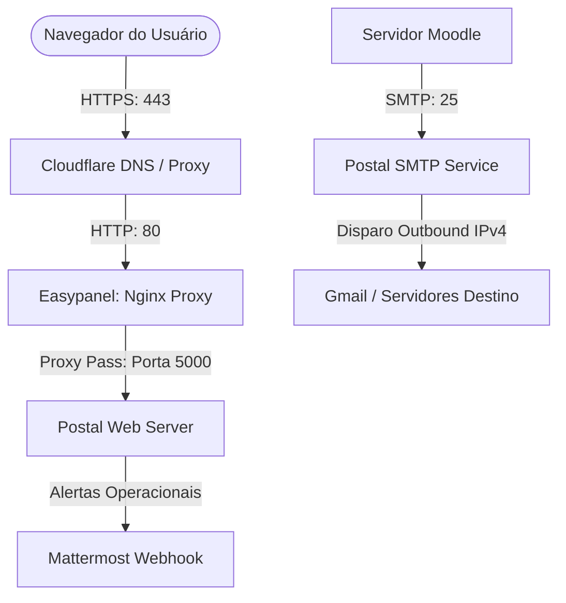

# CDC — Servidor de Disparo de E-mails (Postal)


Este repositório centraliza os scripts de implantação, configurações de Nginx e toda a documentação de infraestrutura do servidor de disparo de e-mails transacionais (Postal v3) da **CDC (Centro de Desenvolvimento e Cidadania)**, integrado ao Moodle e a outros projetos futuros.

---

## 1. Desenho da Arquitetura

O diagrama abaixo descreve a comunicação entre a internet, os servidores DNS da Cloudflare, o proxy Nginx, a stack do Postal e os alertas direcionados ao Mattermost:



---

## 2. Estrutura do Repositório

```text
/ (Raiz do repositório)
├── README.md                           # Este documento (Guia rápido operacional)
├── default.conf                        # Template de proxy reverso do Nginx
├── docker-compose.yml                  # Template unificado de serviços MariaDB + Postal
├── install_postal.sh                   # Script instalador de dependências básicas na VPS
├── resumo_projeto.md                   # Resumo do projeto técnico de e-mail
└── docs/
    ├── diretrizes_documentacao.md      # Governança e regras de atualização
    ├── estrategia_execucao.md          # Branches, ambientes e rollbacks
    ├── migration_guide.md              # Acesso SSH seguro e exportação de dados
    ├── ajuda_infra.md                  # Desenho de portas, DNS e configurações
    ├── postmortem.md                   # Análise cronológica blameless de incidentes
    ├── troubleshooting.md              # Resolução de problemas comuns e emergências
    ├── politica_backup.md              # Rotina de backup criptografado 3-2-1 e restore
    ├── dns_backup.md                   # Backup histórico de registros do Registro.br
    └── prompt_ia.md                    # Contexto permanente de suporte para IAs
```

---

## 3. Requisitos Mínimos do Sistema
*   **CPU:** 2 vCPUs (Mínimo recomendado para processamento de filas e assinaturas DKIM).
*   **Memória RAM:** 4 GB (Recomendado para rodar a stack Postal + MariaDB de forma estável).
*   **Disco:** 40 GB SSD (Com monitoramento ativo de armazenamento de logs e banco).

---

## 4. Inicialização Rápida e Variáveis
1.  **Configurar o ambiente:** Copie o arquivo `.env.example` para `.env` e ajuste todas as variáveis (como senhas e webhooks):
    ```bash
    cp docs/ajuda_infra.md#L94-L106 .env
    ```
2.  **Segurança de Segredos:** Nunca comite arquivos `.env` ou arquivos de senhas reais. Eles estão protegidos por padrão no `.gitignore`.

---

## 5. Cheat Sheet Operacional (Comandos Frequentes)
*   **Iniciar pilha de serviços:** `sudo postal start`
*   **Parar pilha de serviços:** `sudo postal stop`
*   **Exibir status de processos:** `sudo postal status`
*   **Visualizar logs ativos:** `sudo postal logs`

---

## 6. Documentação Detalhada
Para guias específicos de operação, consulte os manuais internos:
*   [Diretrizes de Documentação](file:///home/vier/Documentos/Code/CDC/Email/docs/diretrizes_documentacao.md): Regras de padronização técnica.
*   [Estratégia de Execução](file:///home/vier/Documentos/Code/CDC/Email/docs/estrategia_execucao.md): Políticas de branching e planos de rollback.
*   [Guia de Migração](file:///home/vier/Documentos/Code/CDC/Email/docs/migration_guide.md): Mapeamentos SSH e migração de dados.
*   [Ajuda de Infraestrutura](file:///home/vier/Documentos/Code/CDC/Email/docs/ajuda_infra.md): Topologia de rede, portas e DNS.
*   [Postmortem Técnico](file:///home/vier/Documentos/Code/CDC/Email/docs/postmortem.md): Análise dos incidentes ocorridos e lições aprendidas.
*   [Troubleshooting](file:///home/vier/Documentos/Code/CDC/Email/docs/troubleshooting.md): Resoluções de erros e checklist de quedas.
*   [Política de Backup](file:///home/vier/Documentos/Code/CDC/Email/docs/politica_backup.md): Scripts de backup GPG e rotinas de restore.
*   [Backup do DNS Antigo](file:///home/vier/Documentos/Code/CDC/Email/docs/dns_backup.md): Tabela de consulta dos IPs antigos do Registro.br.
*   [Prompt para IA](file:///home/vier/Documentos/Code/CDC/Email/docs/prompt_ia.md): Arquivo de contexto rápido para assistentes de IA.

---
> [!IMPORTANT]
> **Manutenção e Governança:** Qualquer alteração na infraestrutura do Postal deve ser devidamente documentada nestes arquivos antes de realizar o deploy, garantindo a governança operacional técnica da CDC.
